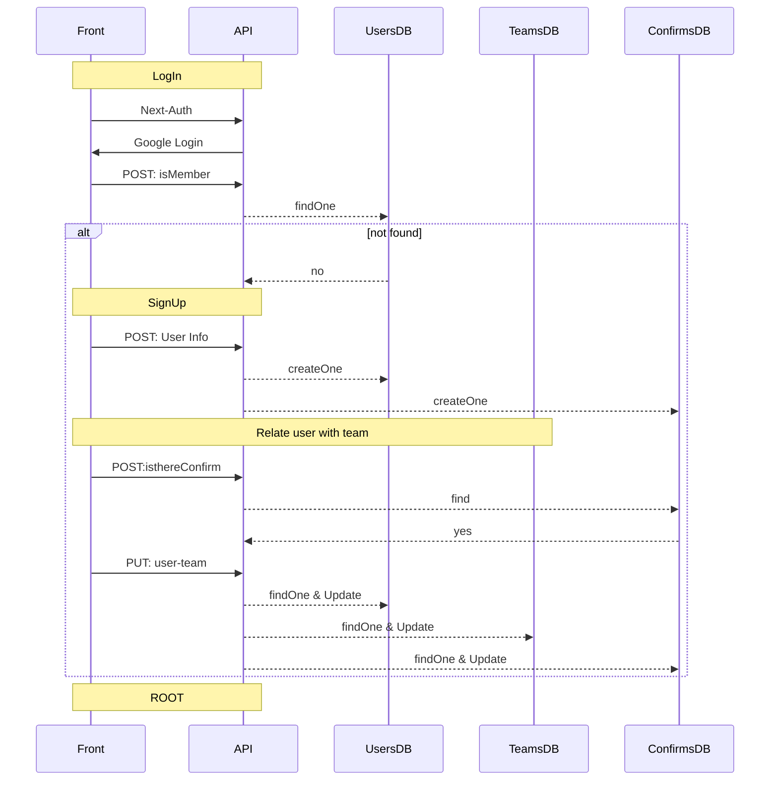

# Google, Naver, Kakao login by NextAuth with MongoDB

1. NextAuth를 이용한 구글로그인, 네이버로그인, 카카오로그인
2. User의 정보는 MongoDB(mongoose)를 이용해 추가정보와 함께 관리



## 추가, 수정된 파일

1. NextAuth를 이용한 구글로그인, 네이버로그인, 카카오로그인

   - /components/login.tsx
   - /lib/mongodb.tsx
   - /pages/api/auth/[...nextauth].tsx
   - /pages/\_app.tsx
   - /pages/index.tsx

2. User의 정보는 MongoDB(mongoose)를 이용해 추가정보와 함께 관리

- ㅁㅇㄴ

## .env

```
DATABASE_URI=mongodb://<username>:<password>@<mongodb.jace.com>
DATABASE_DB=<database name>
DATABASE_COLLECTION_NAUSERS=<collection name of Users>
DATABASE_COLLECTION_NAACCOUNTS=<collection name of Accounts>
DATABASE_COLLECTION_NASESSIONS=<collection name of Sessions>
DATABASE_COLLECTION_NAVERIFICATIONTOKENS=<collection name of VerificationTokens>

NEXTAUTH_URL=http://localhost:3000/api/auth

GOOGLE_ID=<google id>
GOOGLE_SECRET=<google secret>
```

### https://console.cloud.google.com/apis/credentials > 사용자인증정보 > OAuth2.0글라이언트ID

승인된 자바스크립트 원본: http://localhost:3000
승인된 리디렉션 URI: http://localhost:3000/api/auth/callback/google
클라이언트 ID: `<google id>`
클라이언트 보안 비밀번호: `<google secret>`

## References

https://next-auth.js.org/getting-started/example
https://blog.teamelysium.kr/nextjs-auth
https://cpro95.tistory.com/521
https://stackoverflow.com/questions/73606906/next-auth-how-to-get-google-id-token
https://thinkforthink.tistory.com/208
