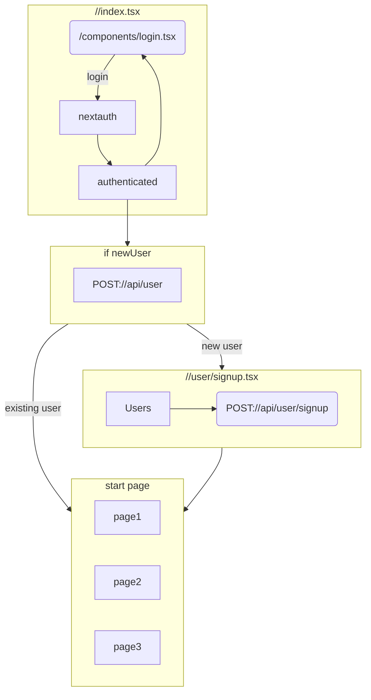

```mermaid
flowchart TB
  subgraph login ["//index.tsx"]
    btnLogin(/components/login.tsx)
    nextauth
    authenticated

    btnLogin --login--> nextauth

    nextauth --> authenticated
    authenticated --> btnLogin

end
subgraph isNew ["if newUser"]
POST://api/user
end
subgraph signup ["//user/signup.tsx"]
Users --> post_signup("POST://api/user/signup")
end
subgraph start ["start page"]
direction LR
page1
page2
page3
end
authenticated --> isNew
isNew -- "new user" --> signup
isNew -- "existing user" --> start
signup --> start

```
