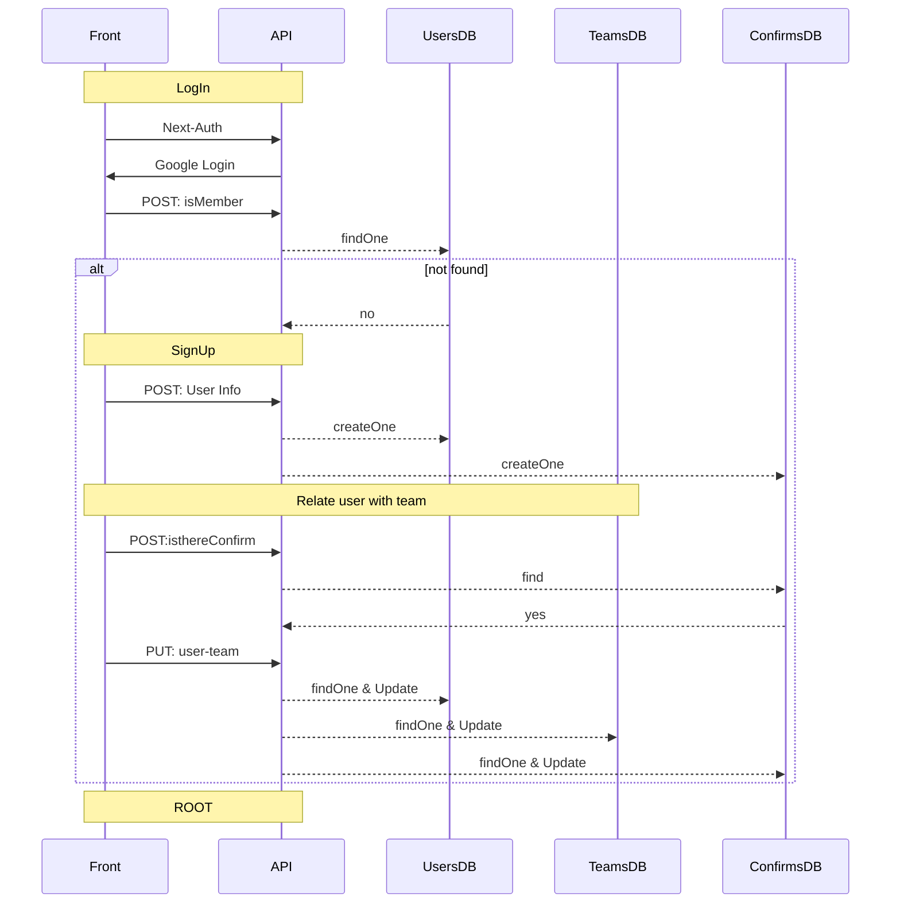

```mermaid
sequenceDiagram
  participant Front
  participant API
  participant UsersDB
  participant TeamsDB
  participant ConfirmsDB

  Note over Front, API: LogIn
  Front ->> API: Next-Auth
  API ->> Front: Google Login

  Front ->> API: POST: isMember
  API -->> UsersDB: findOne
  alt not found
  UsersDB -->> API: no

  Note over Front, API: SignUp
  Front ->> API: POST: User Info
  API -->> UsersDB: createOne
  API -->> ConfirmsDB: createOne

  Note over Front,TeamsDB: Relate user with team
  Front ->> API: POST:isthereConfirm
  API -->> ConfirmsDB: find
  ConfirmsDB -->> API: yes
  Front ->> API: PUT: user-team
  API -->> UsersDB: findOne & Update
  API -->> TeamsDB: findOne & Update
  API -->> ConfirmsDB: findOne & Update
  end

  Note over Front, API: ROOT


```
